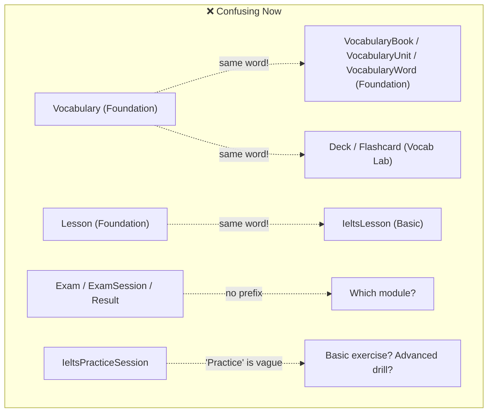

# Schema Model Renaming & Refactoring Plan

> **Goal:** Make every Prisma model name unambiguously convey which IELTS module it belongs to, eliminating confusion in the class diagram, codebase, and thesis documentation.

---

## Current Problem: Name Collision & Ambiguity Map



Your schema has **4 distinct IELTS learning modules** but the model names don't consistently reflect which module they belong to:

| Module | Current Models | Problem |
|:---|:---|:---|
| **Foundation** | `Lesson`, `Vocabulary`, `Grammar`, `PronunciationAttempt`, `VocabularyBook`, `VocabularyUnit`, `VocabularyWord`, `VocabularyExercise`, `VocabularyQuestion`, `VocabularyProgress`, `GrammarBook`, `GrammarUnit`, `GrammarExercise`, `GrammarProgress`, `PronunciationSound`, `SoundExampleWord`, `PronunciationProgress` | No prefix — looks like generic models |
| **Basic** | `IeltsSkill`, `IeltsLesson`, `IeltsListeningExercise`, `IeltsReadingExercise`, `IeltsWritingExercise`, `IeltsBasicProgress`, `IeltsWritingUserAnswer` | Has `Ielts` prefix but it's the wrong one — `IeltsLesson` could be from any IELTS module |
| **Advanced** | `IeltsPracticeListeningPart`, `IeltsPracticeSession`, `IeltsPracticeReadingPart`, `IeltsPracticeReadingSession` | Uses `IeltsPractice` prefix — "Practice" is ambiguous (could mean Basic exercises too) |
| **Intensive** | `Exam`, `ExamSession`, `Result` | No prefix at all — looks like generic platform models |

---

## Proposed Naming Convention

**Pattern:** `{Module}{Entity}`

| Module | Prefix | Example |
|:---|:---|:---|
| Foundation — Vocabulary | `FoundationVocab` | `FoundationVocabBook`, `FoundationVocabUnit` |
| Foundation — Grammar | `FoundationGrammar` | `FoundationGrammarBook`, `FoundationGrammarUnit` |
| Foundation — Pronunciation | `FoundationPronunciation` | `FoundationPronunciationSound` |
| IELTS Basic | `IeltsBasic` | `IeltsBasicSkill`, `IeltsBasicLesson` |
| IELTS Advanced | `IeltsAdvanced` | `IeltsAdvancedListeningPart`, `IeltsAdvancedSession` |
| IELTS Intensive | `IeltsIntensive` | `IeltsIntensiveExam`, `IeltsIntensiveSession` |
| Vocab Lab | _(no change)_ | `Deck`, `Flashcard` — already distinct |

---

## Complete Renaming Table

### 🟢 Foundation — Vocabulary

| Current Model | → New Model | `@@map` (DB table) | Impact |
|:---|:---|:---|:---|
| `Lesson` | `FoundationVocabLesson` | `lessons` (keep) | vocabulary.service.ts |
| `Vocabulary` | `FoundationVocabWord` | `vocabularies` (keep) | vocabulary.service.ts, pronunciation.service.ts |
| `VocabularyBook` | `FoundationVocabBook` | `vocabulary_books` (keep) | vocabulary.service.ts |
| `VocabularyUnit` | `FoundationVocabUnit` | `vocabulary_units` (keep) | vocabulary.service.ts |
| `VocabularyWord` | `FoundationVocabItem` | `vocabulary_words` (keep) | vocabulary.service.ts |
| `VocabularyExercise` | `FoundationVocabExercise` | `vocabulary_exercises` (keep) | vocabulary.service.ts |
| `VocabularyQuestion` | `FoundationVocabQuestion` | `vocabulary_questions` (keep) | vocabulary.service.ts |
| `VocabularyProgress` | `FoundationVocabProgress` | `vocabulary_progress` (keep) | vocabulary.service.ts |
| `PronunciationAttempt` | `FoundationPronunciationAttempt` | `pronunciation_attempts` (keep) | pronunciation.service.ts |

### 🟢 Foundation — Grammar

| Current Model | → New Model | `@@map` (DB table) |
|:---|:---|:---|
| `GrammarBook` | `FoundationGrammarBook` | `grammar_books` (keep) |
| `GrammarUnit` | `FoundationGrammarUnit` | `grammar_units` (keep) |
| `GrammarExercise` | `FoundationGrammarExercise` | `grammar_exercises` (keep) |
| `GrammarProgress` | `FoundationGrammarProgress` | `grammar_progress` (keep) |

### 🟢 Foundation — Pronunciation

| Current Model | → New Model | `@@map` (DB table) |
|:---|:---|:---|
| `PronunciationSound` | `FoundationPronunciationSound` | `pronunciation_sounds` (keep) |
| `SoundExampleWord` | `FoundationSoundExample` | `sound_example_words` (keep) |
| `PronunciationProgress` | `FoundationPronunciationProgress` | `pronunciation_progress` (keep) |

### 🔵 IELTS Basic

| Current Model | → New Model | `@@map` (DB table) | Notes |
|:---|:---|:---|:---|
| `IeltsSkill` | `IeltsBasicSkill` | `ielts_skills` (keep) | Clarifies this is a Basic-level skill grouping |
| `IeltsLesson` | `IeltsBasicLesson` | `ielts_lessons` (keep) | Currently confusing — "IeltsLesson" sounds like any IELTS lesson |
| `IeltsListeningExercise` | `IeltsBasicListeningExercise` | `ielts_listening_exercises` (keep) | Adds `Basic` to distinguish from Advanced listening |
| `IeltsReadingExercise` | `IeltsBasicReadingExercise` | `ielts_reading_exercises` (keep) | Same |
| `IeltsWritingExercise` | `IeltsBasicWritingExercise` | `ielts_writing_exercises` (keep) | Same |
| `IeltsBasicProgress` | _(no change)_ | `ielts_basic_progress` (keep) | Already correctly prefixed |
| `IeltsWritingUserAnswer` | `IeltsBasicWritingAnswer` | `ielts_writing_user_answers` (keep) | Shorter + consistent |

### 🟡 IELTS Advanced

| Current Model | → New Model | `@@map` (DB table) | Notes |
|:---|:---|:---|:---|
| `IeltsPracticeListeningPart` | `IeltsAdvancedListeningPart` | `ielts_practice_listening_parts` (keep) | "Practice" → "Advanced" |
| `IeltsPracticeSession` | `IeltsAdvancedListeningSession` | `ielts_practice_sessions` (keep) | Explicit: this is a listening session |
| `IeltsPracticeReadingPart` | `IeltsAdvancedReadingPart` | `ielts_practice_reading_parts` (keep) | "Practice" → "Advanced" |
| `IeltsPracticeReadingSession` | `IeltsAdvancedReadingSession` | `ielts_practice_reading_sessions` (keep) | Same |

### 🔴 IELTS Intensive

| Current Model | → New Model | `@@map` (DB table) | Notes |
|:---|:---|:---|:---|
| `Exam` | `IeltsIntensiveExam` | `exams` (keep) | Most critical rename — `Exam` is too generic |
| `ExamSession` | `IeltsIntensiveSession` | `exam_sessions` (keep) | Clarifies this is a full mock session |
| `Result` | `IeltsIntensiveResult` | `results` (keep) | `Result` is extremely generic — could be anything |

### ⚪ Legacy / Unused (Consider Removing)

| Current Model | Assessment | Recommendation |
|:---|:---|:---|
| `LearningMaterial` | Generic content model — likely from early IELTS era | Check if still used. If not, **remove** |
| `LearningProgress` | Same — generic progress tracker | Check if still used. If not, **remove** |

---

## Enums to Rename

| Current Enum | → New Enum | Reason |
|:---|:---|:---|
| `ExamType` | `IeltsIntensiveExamType` | Matches the `IeltsIntensiveExam` model |
| `SessionStatus` | `IeltsIntensiveSessionStatus` | Matches `IeltsIntensiveSession` |
| `MaterialType` | _(remove if unused)_ | Likely legacy from IELTS era |
| `Difficulty` | _(keep as-is)_ | Shared across modules — genuinely generic |

---

## Impact Analysis

### Backend Files to Update

| File | Models Referenced |
|:---|:---|
| vocabulary.service.ts | `Lesson`, `Vocabulary`, `VocabularyBook/Unit/Word/Exercise/Question/Progress` |
| grammar.service.ts | `GrammarBook/Unit/Exercise/Progress` |
| pronunciation.service.ts | `PronunciationAttempt/Sound/Progress`, `Vocabulary` |
| learning.service.ts | `LearningMaterial`, `LearningProgress` |
| exams.service.ts | `Exam`, `ExamSession` |
| results.service.ts | `Result`, `ExamSession` |
| ielts.service.ts | `IeltsSkill`, `IeltsLesson`, all IELTS exercises |
| ielts-advanced.service.ts | `IeltsPractice*` models |
| users.service.ts | `ExamSession`, `Result`, `IeltsPractice*` |
| gamification.service.ts | Multiple models across all modules |

### Frontend Files to Update

| File | Models Referenced |
|:---|:---|
| StatisticsContent.tsx | `Result`, `ExamSession` types |
| IntensiveContent.tsx | `Exam`, `ExamSession`, `Result` |
| HistoryContent.tsx | `Result`, `ExamSession` |

> [!IMPORTANT]
> **The `@@map("table_name")` stays the same.** This means the actual PostgreSQL table names don't change, so **no database migration is needed**. Only Prisma model names (used in code) change. After renaming, run `npx prisma generate` to regenerate the client.

---

## Execution Strategy

> [!WARNING]
> This is a **code-only refactoring** — zero database changes. But it touches many files. Follow this order carefully.

### Phase 1: Schema Rename (1 file) ✅ COMPLETE
1. Rename all models in `schema.prisma` per the table above
2. Keep all `@@map(...)` values identical
3. Run `npx prisma generate` — verify no errors

### Phase 2: Backend Services (search & replace) ✅ COMPLETE
1. For each service file, replace old Prisma accessor names:
   - `prisma.exam.` → `prisma.ieltsIntensiveExam.`
   - `prisma.examSession.` → `prisma.ieltsIntensiveSession.`
   - `prisma.result.` → `prisma.ieltsIntensiveResult.`
   - `prisma.lesson.` → `prisma.foundationVocabLesson.`
   - `prisma.vocabulary.` → `prisma.foundationVocabWord.`
   - etc.
2. Run `npm run build` after each file to catch TypeScript errors

### Phase 3: Frontend Types (if any typed imports) ✅ COMPLETE
1. Update any TypeScript interfaces that reference old model names
2. Most frontend code uses API responses (JSON), so impact is minimal

### Phase 4: Regenerate Class Diagram ⬅️ NEXT
1. Re-run `node generate-puml.js` to produce a new diagram with clean, unambiguous class names

---

## Before & After Class Diagram Preview

### Before (Confusing)
```
┌──────────┐    ┌──────────────┐    ┌──────────┐
│  Lesson  │    │ IeltsLesson  │    │   Exam   │
│  (???)   │    │   (???)      │    │  (???)   │
└──────────┘    └──────────────┘    └──────────┘
     Which module does each belong to?
```

### After (Clear)
```
┌─────────────────────┐  ┌──────────────────┐  ┌───────────────────────┐
│FoundationVocabLesson│  │ IeltsBasicLesson │  │ IeltsIntensiveExam    │
│     (Foundation)    │  │     (Basic)      │  │     (Intensive)       │
└─────────────────────┘  └──────────────────┘  └───────────────────────┘
     Every name tells you exactly where it lives.
```

---

## Current Status

> [!NOTE]
> **Phases 1–3 are complete.** The schema, all backend services, and frontend types have been updated with the new naming convention. No database migration was needed (all `@@map` values preserved).

### Remaining Decisions

| Item | Status | Action Needed |
|:---|:---|:---|
| `LearningMaterial` + `LearningProgress` | Still in schema | Decide: **remove** or keep? |
| `Grammar` model | Not renamed | Decide: rename to `FoundationVocabGrammar`? |
| Class diagram regeneration | Pending | Run `node generate-puml.js` |
