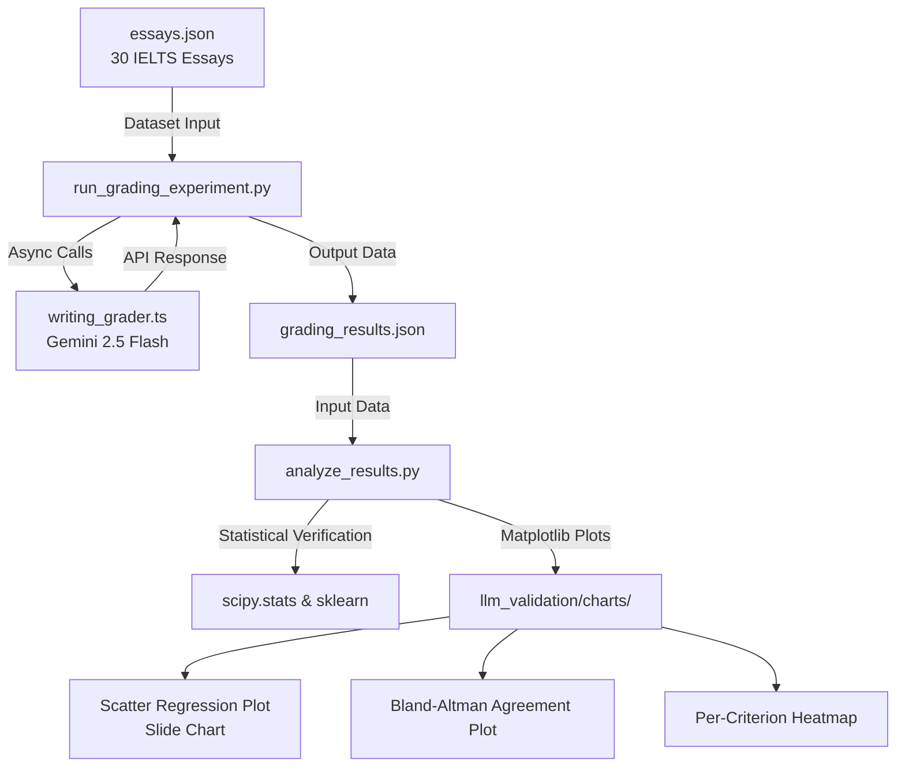

# System Validation Methodology: IELTS Writing Automated Grading

This document details the exact methodology, architecture, and codebase used to validate the IELTS Writing Automated Grading system. It explains the end-to-end workflow behind the **Writing Grading Evaluation** slide (Pearson correlation $r = 0.97$, Quadratic Weighted Kappa $\kappa = 0.96$).

---

## 1. End-to-End Validation Architecture



---

## 2. Phase-by-Phase Execution

### Phase 1: Ground-Truth Dataset (`essays.json`)
*   **The Data:** You compiled a test set of **30 verified IELTS essays** representing a balanced distribution of proficiency levels (Low, Mid, High).
*   **Human Scores:** Each essay was pre-graded by a certified IELTS expert to establish a ground-truth benchmark across the four standard sub-rubrics:
    1.  **Task Achievement (TA)**
    2.  **Coherence and Cohesion (CC)**
    3.  **Lexical Resource (LR)**
    4.  **Grammatical Range and Accuracy (GRA)**

### Phase 2: Live Automated Grading (`run_grading_experiment.py`)
*   **The Execution:** You ran the live grading script located at `llm_validation/run_grading_experiment.py`.
*   **Backend Integration:** The script imported your core NestJS/Node backend grading module (`grade_writing`) from `backend-ai`. 
*   **Rate-Limit Management:** To respect the Gemini API rate limits, it processed grading tasks sequentially with a **4-second cooling delay** between requests.
*   **Output:** The results—mapping human criteria bands directly to LLM criteria bands—were compiled and saved to `llm_validation/results/grading_results.json`.

### Phase 3: Statistical Validation & Figure Generation (`analyze_results.py`)
You executed your statistical pipeline in `analyze_results.py` to calculate the mathematical proofs and plot the figures:

1.  **Pearson Correlation ($r = 0.97$):** Measures the strong linear relationship using `scipy.stats.pearsonr`.
2.  **Quadratic Weighted Kappa ($\kappa = 0.96$):** Calculated using `sklearn.metrics.cohen_kappa_score` by scaling bands into discrete indices to prove inter-rater reliability.
3.  **Mean Absolute Error (MAE = 0.16 bands):** Calculated using `numpy` to show that the average difference between the AI and human score is less than **one-fifth of a band**.
4.  **Matplotlib Figures Generated (300 DPI):**
    *   **Scatter Plot (`human_vs_llm_scatter.png`):** Shows individual essay plots, the $y=x$ ideal line, and your actual blue regression line (used directly in your slides!).
    *   **Bland-Altman Plot (`bland_altman_plot.png`):** Analyzes agreement limits and shows zero correlation between disagreement scale and essay proficiency.
    *   **Criterion Heatmap (`per_criterion_heatmap.png`):** Breaks down $r$, Spearman $\rho$, and Kappa across all 4 core rubrics to prove uniform grading accuracy.

---

## 3. How to Regenerate the Figures & Calculations

If your committee asks to see how the statistical figures were compiled, you can regenerate the entire analysis and charts in seconds!

### Prerequisites:
Make sure you have scientific Python libraries installed:
```powershell
pip install numpy scipy scikit-learn matplotlib seaborn pandas
```

### Run the Analysis:
Navigate to the validation folder and run:
```powershell
cd c:\Users\Admin\Desktop\thesis\merge_v2\thesis-toeic-system\_extras\research-paper\llm_validation
python analyze_results.py
```

### Outputs:
*   The math prints immediately in your console.
*   All three figures are saved to `llm_validation/charts/` ready for inclusion in your paper or slides!
