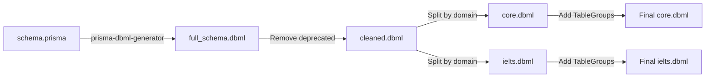

# DBML Generation Plan for dbdiagram.io

## Context

You have three authoritative sources that all represent the same data model:

| Source | Format | Status |
|--------|--------|--------|
| [schema.prisma](file:///c:/Users/Admin/Desktop/thesis/merge/thesis-toeic-system/backend-core/prisma/schema.prisma) | Prisma ORM schema | **Source of truth** (1465 lines, 60+ models) |
| [core.puml](file:///c:/Users/Admin/Desktop/thesis/merge/thesis-toeic-system/_thesis-paper/2.%20class-diagram/v5/core.puml) | PlantUML class diagram | Finalized (v5) |
| [ielts.puml](file:///c:/Users/Admin/Desktop/thesis/merge/thesis-toeic-system/_thesis-paper/2.%20class-diagram/v5/ielts.puml) | PlantUML class diagram | Finalized (v5) |

The class diagram PNGs you shared (from `xmi/v2/` and `xmi/v3/`) are the Visual Paradigm exports of these same models.

> [!NOTE]
> Your Prisma schema already has a **commented-out** `prisma-dbml-generator` block (lines 8–12), suggesting you explored this before.

---

## Approach 1: Automated — `prisma-dbml-generator` (Recommended Start)

The fastest path. This Prisma generator converts your entire `schema.prisma` into valid DBML in one command.

### Steps

```bash
# 1. Install the generator
cd backend-core
npm install -D prisma-dbml-generator

# 2. Uncomment & update the generator block in schema.prisma
```

```prisma
generator dbml {
  provider   = "prisma-dbml-generator"
  output     = "../../_thesis-paper/3. relational-diagram"
  outputName = "full_schema.dbml"
}
```

```bash
# 3. Generate
npx prisma generate
```

This will produce a single `full_schema.dbml` with all tables and relationships.

### Pros & Cons

| ✅ Pros | ⚠️ Cons |
|---------|---------|
| 100% accurate to the DB schema | Includes deprecated models (LearningMaterial, Grammar, etc.) |
| Zero manual effort | Single monolithic file — not split into Core/IELTS domains |
| Relationship cardinalities auto-extracted | Enums may need manual re-ordering for visual clarity |
| Re-runnable any time schema changes | No table grouping — flat list |

### Post-Processing Needed
- Remove deprecated models (lines 172–317 in schema)
- Split into `core.dbml` and `ielts.dbml` manually
- Add `TableGroup` blocks for visual organization on dbdiagram.io

---

## Approach 2: Manual — I Generate DBML Directly from Your PlantUML

I can read the finalized `core.puml` and `ielts.puml` and translate them into DBML, applying the correct mapping rules. This gives you **thesis-quality** output that mirrors your class diagram structure exactly.

### Mapping Rules: UML → DBML

| UML Concept | DBML Equivalent | Example |
|-------------|----------------|---------|
| Class attributes | Table columns | `id varchar [pk]` |
| `String` | `varchar` | |
| `Int` | `int` | |
| `Float` | `float` | |
| `Boolean` | `boolean` | |
| `DateTime` | `timestamp` | |
| `Json` | `json` | |
| `String[]` | `varchar[]` | PostgreSQL array |
| `[0..1]` (nullable) | `[null]` | |
| `@default(now())` | `[default: \`now()\`]` | |
| `@id` | `[pk]` | |
| `@unique` | `[unique]` | |
| Enum | `enum EnumName { ... }` | |
| `1 -- 0..*` (association) | `Ref: >` (many-to-one) | |
| `1 *-- 0..*` (composition) | `Ref: >` + `[delete: cascade]` | |
| `1 o-- 0..*` (aggregation) | `Ref: >` (no cascade) | |

### Example Output — Core Domain (Partial)

```dbml
// ============================================================
// CORE DOMAIN — Relational Schema
// ============================================================

Enum UserRole {
  STUDENT
  ADMIN
  INSTRUCTOR
}

Enum CardState {
  NEW
  LEARNING
  REVIEW
  RELEARNING
}

Enum SubscriptionTier {
  FREE
  PREMIUM
  PRO
}

Enum SubscriptionStatus {
  ACTIVE
  TRIALING
  PAST_DUE
  CANCELED
  EXPIRED
}

Enum PaymentProvider {
  MOCK
  VNPAY
  STRIPE
  MANUAL
}

Enum NotificationType {
  STREAK_MILESTONE
  LESSON_COMPLETED
  REVIEW_DUE
  DECK_MASTERED
  EXAM_GRADED
  NEW_EXAM_AVAILABLE
  DICTATION_COMPLETE
  NEW_LESSON
  SYSTEM_ANNOUNCEMENT
  ACHIEVEMENT
}

Enum PostType {
  STUDY_TIP
  SCORE_ACHIEVEMENT
  GENERAL
}

Table users {
  id            varchar     [pk]
  email         varchar     [unique, not null]
  password      varchar     [null]
  googleId      varchar     [unique, null]
  avatar        varchar     [null]
  firstName     varchar     [null]
  lastName      varchar     [null]
  role          UserRole    [not null, default: 'STUDENT']
  isActive      boolean     [not null, default: true]
  createdAt     timestamp   [not null, default: `now()`]
  updatedAt     timestamp   [not null]
}

Table decks {
  id            varchar     [pk]
  userId        varchar     [not null, ref: > users.id]
  name          varchar     [not null]
  createdAt     timestamp   [not null, default: `now()`]
  updatedAt     timestamp   [not null]
}

Table flashcards {
  id            varchar     [pk]
  deckId        varchar     [not null, ref: > decks.id]
  front         varchar     [not null]
  back          text        [not null]
  tags          "varchar[]" [not null, default: '{}']
  due           timestamp   [not null, default: `now()`]
  stability     float       [not null, default: 0]
  difficulty    float       [not null, default: 0]
  elapsedDays   int         [not null, default: 0]
  scheduledDays int         [not null, default: 0]
  reps          int         [not null, default: 0]
  lapses        int         [not null, default: 0]
  lastReview    timestamp   [null]
  nextReviewDate timestamp  [not null, default: `now()`]
  cardState     CardState   [not null, default: 'NEW']
  cardTypeId    varchar     [null, ref: > card_types.id]
  fieldValues   json        [not null, default: '{}']
  fieldStyles   json        [null]
  cardStyle     json        [null]
  createdAt     timestamp   [not null, default: `now()`]
  updatedAt     timestamp   [not null]
}

Table flashcard_reviews {
  id            varchar     [pk]
  flashcardId   varchar     [not null, ref: > flashcards.id]
  rating        int         [not null]
  reviewedAt    timestamp   [not null, default: `now()`]
  scheduledDays int         [not null, default: 0]
  elapsedDays   int         [not null, default: 0]
  state         CardState   [null]
}

// ... (more tables follow the same pattern)
```

---

## Approach 3: Hybrid — Auto-generate, Then Split & Refine

This is what I'd recommend for thesis quality:



### Domain Split Strategy (Matches Your Class Diagrams)

**`core.dbml`** — Tables from `core.puml`:
| Group | Tables |
|-------|--------|
| **Identity** | `users` |
| **Vocab Lab** | `decks`, `flashcards`, `flashcard_reviews`, `card_types`, `card_type_fields`, `card_templates`, `shared_decks` |
| **Shadowing** | `shadowing_videos`, `shadowing_folders`, `shadowing_progress` |
| **Dictation** | `dictation_videos`, `dictation_folders`, `dictation_progress` |
| **Community** | `posts`, `comments`, `post_likes`, `post_bookmarks` |
| **Gamification** | `achievements`, `user_achievements`, `xp_logs` |
| **Billing** | `subscriptions`, `payments`, `usage_records`, `pricing_plans` |
| **Platform** | `student_teacher_links`, `notifications`, `question_notes` |

**`ielts.dbml`** — Tables from `ielts.puml`:
| Group | Tables |
|-------|--------|
| **Identity** | `users` (reference only), `ielts_profiles` |
| **Foundation Vocab** | `vocabulary_books`, `vocabulary_units`, `vocabulary_words`, `vocabulary_questions`, `vocabulary_progress` |
| **Foundation Grammar** | `grammar_books`, `grammar_units`, `grammar_exercises`, `grammar_progress` |
| **Foundation Pronunciation** | `pronunciation_sounds`, `sound_example_words`, `pronunciation_progress` |
| **IELTS Basic** | `ielts_skills`, `ielts_lessons`, `ielts_listening_exercises`, `ielts_reading_exercises`, `ielts_writing_exercises`, `ielts_speaking_exercises`, `ielts_basic_progress`, `ielts_writing_user_answers` |
| **IELTS Intensive** | `exams`, `exam_sessions`, `results` |
| **IELTS Advanced** | `ielts_practice_listening_parts`, `ielts_practice_sessions`, `ielts_practice_reading_parts`, `ielts_practice_reading_sessions`, `ielts_advanced_writing_prompts`, `ielts_advanced_writing_sessions`, `ielts_advanced_speaking_parts`, `ielts_advanced_speaking_sessions` |

### Using TableGroups on dbdiagram.io

```dbml
TableGroup VocabLab {
  decks
  flashcards
  flashcard_reviews
  card_types
  card_type_fields
  card_templates
}

TableGroup Community {
  posts
  comments
  post_likes
  post_bookmarks
  shared_decks
}
```

---

## Approach 4: Let Me Do It All Right Now

If you want, I can generate both complete DBML files for you right now by:

1. Reading the finalized PlantUML class diagrams (v5)
2. Cross-referencing with `schema.prisma` for exact column types, defaults, and `@@map` table names
3. Outputting two thesis-ready files:
   - `_thesis-paper/3. relational-diagram/core.dbml`  
   - `_thesis-paper/3. relational-diagram/ielts.dbml`

This ensures the DBML uses the **actual PostgreSQL table names** (from `@@map`) and perfectly matches your class diagram domain split.

---

## Decision Matrix

| Criteria | Approach 1 (Auto) | Approach 2 (Manual) | Approach 3 (Hybrid) | Approach 4 (I do it) |
|----------|-------------------|--------------------|--------------------|---------------------|
| **Speed** | ⚡ Fastest | 🐢 Slowest | ⚡ Fast | ⚡ Fast |
| **Accuracy** | ✅ 100% schema | ✅ Matches class diagrams | ✅ Both | ✅ Both |
| **Domain split** | ❌ Manual | ✅ Built-in | ✅ Built-in | ✅ Built-in |
| **TableGroups** | ❌ Manual | ✅ Built-in | ✅ Built-in | ✅ Built-in |
| **Deprecated cleanup** | ❌ Manual | ✅ Excluded | ✅ Excluded | ✅ Excluded |
| **Thesis-ready** | ⚠️ Needs work | ✅ Yes | ✅ Yes | ✅ Yes |

> [!IMPORTANT]
> **My recommendation**: Go with **Approach 4** — tell me to proceed and I'll generate both `core.dbml` and `ielts.dbml` files right now, ready to paste into dbdiagram.io.

---

## Questions for You

1. **Which approach** do you want to go with?
2. Should the DBML use **Prisma model names** (e.g., `Flashcard`) or **PostgreSQL table names** (e.g., `flashcards`) as the table identifiers?
3. Do you want `Ref` lines **inline** (inside the table definition) or **standalone** (separate `Ref:` blocks at the bottom)?
4. Should I include the **`VideoProgress`** / **`VideoFolder`** tables that appear in the core class diagram image but seem to be aliased as `ShadowingProgress`/`DictationProgress` in the schema?
