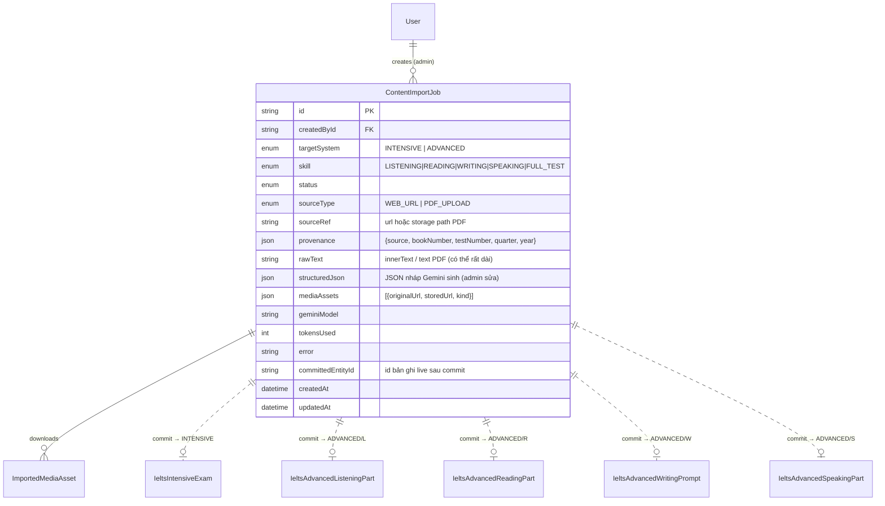

# 02 — Thiết kế Database Schema & JSON Contract

> Trả lời trực tiếp yêu cầu: *"thiết kế chi tiết cấu trúc Database Schema tối ưu cho cả 4 kỹ năng"*.
> Nguyên tắc theo **D4**: **không đổi hình dạng bảng live** (giữ ngân hàng Advanced + đề Intensive như cũ),
> chỉ **thêm 1 bảng staging** + **vài cột provenance (additive)**, và định nghĩa **JSON Contract** chặt chẽ
> làm "hợp đồng" giữa Gemini (bên xuất) và Importer (bên nhận).

---

## 2.1. Nguyên tắc thiết kế

1. **Live tables bất biến** → grader, mobile, web đang đọc chúng; đổi hình dạng = vỡ dây chuyền. Chỉ **thêm cột**.
2. **Tách Draft khỏi Live** → mọi dữ liệu "đang chờ duyệt" sống trong `ContentImportJob.structuredJson` (Json),
   **không** chạm bảng live cho tới khi Admin bấm *Commit*.
3. **Provenance & Idempotency** → mỗi nội dung live ghi rõ nguồn (`source`, `bookNumber`, `testNumber`) để
   truy vết + chống import trùng.
4. **Contract-first** → schema JSON (§2.5) là nguồn chân lý dùng chung cho: `responseSchema` của Gemini,
   validator backend, và form editor frontend.

---

## 2.2. ER tổng quan (bảng mới + quan hệ)



> `||..o|` = quan hệ "mềm" (chỉ lưu `committedEntityId`, **không** ràng buộc FK cứng) — vì 1 job có thể commit
> vào một trong nhiều bảng tuỳ `targetSystem`/`skill`.

---

## 2.3. Bảng mới: `ContentImportJob` (staging)

```prisma
enum ContentImportTargetSystem {
  INTENSIVE
  ADVANCED
}

enum ContentImportSkill {
  LISTENING
  READING
  WRITING
  SPEAKING
  FULL_TEST          // chỉ dùng cho Intensive type=FULL_TEST
}

enum ContentImportSourceType {
  WEB_URL
  PDF_UPLOAD
}

enum ContentImportStatus {
  PENDING            // vừa tạo, chờ worker
  SCRAPING           // đang cào web / đọc PDF + tải media
  EXTRACTING         // đang gọi Gemini cấu trúc hoá
  AWAITING_REVIEW    // đã có structuredJson, chờ admin duyệt
  COMMITTING         // admin bấm lưu, đang ghi bảng live
  COMMITTED          // hoàn tất, đã có committedEntityId
  FAILED             // lỗi scrape/gemini/commit (xem error)
  DISCARDED          // admin huỷ bản nháp
}

model ContentImportJob {
  id            String                    @id @default(uuid())
  createdById   String
  createdBy     User                      @relation(fields: [createdById], references: [id])

  targetSystem  ContentImportTargetSystem
  skill         ContentImportSkill
  groupId       String?                      // dùng cho FULL_TEST: nhiều job cùng groupId = cùng 1 IeltsIntensiveExam
  groupExpiresAt DateTime?                    // = createdAt + 7 ngày khi tạo group; cron auto-DISCARD job FAILED/PENDING quá hạn
  status        ContentImportStatus       @default(PENDING)

  // --- Nguồn ---
  sourceType    ContentImportSourceType
  sourceRef     String                    @db.Text   // URL hoặc GCS path của PDF đã upload
  contractVersion String   @default("v1")    // phiên bản JSON Contract — tăng khi schema Gemini thay đổi
  provenance    Json                      // { source, bookNumber?, testNumber?, quarter?, year?, title? }

  // --- Dữ liệu pipeline ---
  rawText       String?                   @db.Text   // Stage 1 output (innerText / PDF text)
  structuredJson Json?                                // Stage 2 output (Gemini) = bản nháp admin sửa
  mediaAssets   Json?                                 // [{ originalUrl, storedUrl, kind, bytes? }]

  // --- Telemetry & kết quả ---
  geminiModel   String?
  tokensUsed    Int?
  error         String?                   @db.Text
  committedEntityId String?                            // id của IeltsIntensiveExam / *Part / *Prompt

  processingStartedAt DateTime?              // worker ghi khi bắt đầu xử lý — dùng để detect stuck job
  version       Int       @default(0)        // optimistic locking — client gửi kèm khi PATCH, backend reject nếu lệch
  createdAt     DateTime                  @default(now())
  updatedAt     DateTime                  @updatedAt

  @@index([createdById])
  @@index([status])
  @@index([targetSystem, skill])
  @@index([groupId])
  @@map("content_import_jobs")
}
```

**Vì sao đủ tối ưu:**
- `structuredJson` (Json) đóng vai "form nháp" — không cần bảng con cho từng question; mọi hình dạng kỹ năng đều
  chứa được. Khi commit mới "đổ" sang bảng live đúng định dạng.
- `rawText` lưu để **tái chạy Gemini** (re-extract) nếu prompt/schema cải tiến, **không phải scrape lại** (tiết kiệm).
- `mediaAssets` lưu map `originalUrl → storedUrl` để re-render & dedup.
- Index theo `status` phục vụ màn "Hàng đợi import" của admin.
- `geminiModel`/`tokensUsed` cho phép **theo dõi chi phí từng job**; kết hợp **cache theo `hash(rawText+schema+model)`** để bỏ qua call Gemini trùng (chiến lược đầy đủ ở [`03` §3.8](./03-data-flow-and-pipeline.md)).

> Cần thêm quan hệ ngược `importJobs ContentImportJob[]` vào model `User`.

> **Commit mặc định `isPublished = false`:** `IeltsContentCommitService` phải hardcode `isPublished = false`
> khi tạo bản ghi live, bất kể giá trị trong `structuredJson`. Admin publish riêng qua `PATCH /:id/publish`.
> Tránh đề chưa kiểm duyệt bị học viên thấy ngay sau commit.

> **FULL_TEST = 4 job riêng lẻ (hybrid: per-job Discard + per-group Abandon):** Thay vì 1 job chứa JSON khổng lồ
> cho cả 4 kỹ năng, `type=FULL_TEST` được hiện thực bằng 4 job riêng (LISTENING / READING / WRITING / SPEAKING)
> dùng chung `groupId`; mỗi job có vòng đời độc lập, admin thấy chúng như 1 nhóm trong UI.
>
> **Rule commit group** (giữ tinh thần "commit = không còn job dang dở"):
> - ✅ commit khi **mọi job** trong group là `COMMITTED` **hoặc** `DISCARDED`.
> - ❌ block nếu còn job ở `PENDING / SCRAPING / EXTRACTING / AWAITING_REVIEW / FAILED`.
>
> **2 action mở khoá:** `POST /import/:jobId/discard-skill` (bỏ 1 kỹ năng → nếu phần còn lại đều `COMMITTED` thì
> group tự unlock); `POST /import/group/:groupId/abandon` (bỏ cả group → mọi job `DISCARDED`).
>
> **Suy `type` thực tế khi commit** (chỉ tính job `COMMITTED`): 4 skill → 1 đề `FULL_TEST`; **2–3 skill → 2–3 đề
> single-skill RIÊNG LẺ** (không phải 1 đề tổng hợp → tránh thêm enum, tái dùng luồng single-skill); 1 skill → 1 đề
> single-skill. Pseudocode đầy đủ ở [`03` §3.6](./03-data-flow-and-pipeline.md).
>
> **Group TTL chống "zombie":** `groupExpiresAt = createdAt + 7 ngày`; cron (Phase 8.9) auto-`DISCARD` job
> `FAILED/PENDING` quá hạn + ghi log.

---

## 2.4. Cột provenance bổ sung trên bảng live (additive — không phá vỡ)

Mục tiêu: truy vết nguồn + chống trùng + cờ "ẩn cho tới khi duyệt". **Tất cả đều `?` (nullable) hoặc có default**
nên migration an toàn với dữ liệu cũ.

| Bảng | Cột thêm | Lý do |
|------|---------|-------|
| `IeltsIntensiveExam` | `source String?`, `bookNumber Int?`, `testNumber Int?`, `quarter String?`, `year Int?`, `importJobId String?` | Hiện **không có** provenance; cần để truy vết + chống trùng đề |
| `IeltsAdvancedListeningPart` | `source String?`, `bookNumber Int?`, `testNumber Int?`, `isPublished Boolean @default(true)`, `importJobId String?` | Đang thiếu hẳn provenance & cờ publish |
| `IeltsAdvancedReadingPart` | (như Listening) | nt |
| `IeltsAdvancedWritingPrompt` | `importJobId String?` | đã có `source/category/bookNumber/testNumber/isPublished` rồi |
| `IeltsAdvancedSpeakingPart` | `importJobId String?` | nt |

**Khoá chống trùng (logic, không nhất thiết DB-unique):**
- Intensive: `(type, source, bookNumber, testNumber)` → vd `(READING, "cambridge_17", 17, 1)`.
- Advanced L/R: `(source, bookNumber, testNumber, partNumber)`.
> **Advanced W/S:** `engnovateSlug` hiện là `@unique` trên `IeltsAdvancedWritingPrompt` và
> `@@unique([engnovateSlug, partNumber])` trên `IeltsAdvancedSpeakingPart`. Khi import từ nguồn không phải
> Engnovate (Cambridge, Forecast), `engnovateSlug` sẽ là `null`. PostgreSQL cho phép nhiều `NULL` trong cột
> `UNIQUE` (vì `NULL ≠ NULL`), nên không xảy ra lỗi P2002 về mặt kỹ thuật. Tuy nhiên, `engnovateSlug` không
> còn là natural key đáng tin cậy cho mọi nguồn. **Quyết định:** giữ `engnovateSlug` như metadata (không gỡ
> constraint cũ để tránh breaking change), nhưng logic chống trùng trong `CommitService` phải ưu tiên
> composite key `(source, bookNumber, testNumber, partNumber)` — chỉ fallback sang `engnovateSlug` khi nó
> khác `null`.

> Cân nhắc thêm `@@unique` mềm cho L/R sau khi backfill dữ liệu cũ (Approval Gate ở Phase 1).

> **Soft-delete cho bảng live có session:** Không hard delete `IeltsIntensiveExam` hay `IeltsAdvanced*Part/Prompt`
> nếu đã có session của học viên (`IeltsIntensiveSession`, `IeltsAdvancedListeningSession`, v.v.) liên kết —
> sẽ tạo orphaned records hoặc vi phạm FK constraint. Giải pháp: thêm `isArchived Boolean @default(false)`
> vào các bảng live; route `DELETE` của admin chỉ set `isArchived = true`, không xóa vật lý.
> Xóa vật lý chỉ thực hiện qua script bảo trì khi đã xác nhận không còn session nào tham chiếu.

---

## 2.5. JSON Contract theo từng kỹ năng (phần quan trọng nhất)

Đây là "hợp đồng" Gemini phải tuân thủ. **Bắt buộc khớp 100% với cái grader đọc** (xem §1.2, §1.3). Mỗi mục dưới
nêu rõ: (a) target nào dùng, (b) hình dạng, (c) **vị trí answer-key** mà grader đòi.

### Taxonomy `type` (dùng chung cho `content[]` của L/R)

| `type` | Kỹ năng | "Ngăn" chứa câu hỏi | Vị trí đáp án (grader đọc) |
|--------|---------|---------------------|-----------------------------|
| `form_completion` / `note_completion` | L, R | `points: [{question_number, text, answer}]` | `point.answer` (hoặc `acceptable_answers[]`) |
| `sentence_completion` / `summary_completion` / `short_answer` | L, R | `questions: [{question_number, text, answer}]` | `q.answer` / `q.acceptable_answers` |
| `multiple_choice` | L, R | `questions: [{question_number, text, options[], answer}]` | `q.answer` (letter) |
| `multiple_choice_multiple` | L | `{question_numbers[], options[], answers[]}` | `answers[i]` theo `question_numbers[i]` |
| `matching` / `matching_features` / `matching_information` / `matching_headings` | L, R | `items: [{id, text}]` + `answers: {itemId: letter}` | `answers[item.id]` (`.letter` hoặc giá trị) |
| `table_completion` | L, R | `rows: [{cells[], questions: {qNum: {answer}}}]` | `row.questions[qNum].answer` |
| `true_false_not_given` / `yes_no_not_given` | R | `items: [{question_number, question_text, answer}]` | `item.answer` ∈ {TRUE,FALSE,NOT GIVEN}/{YES,NO,NOT GIVEN} |

> Importer/validator phải **whitelist** đúng các `type` này; `type` lạ → cảnh báo, không commit. Đáp án completion
> cho phép `answer: "A/B"` (thay thế) và `"colo(u)r"` (tuỳ chọn) vì `parseIELTSAnswer` đã hỗ trợ.

### A) LISTENING

**Advanced (`IeltsAdvancedListeningPart`)** — Gemini xuất 1 object:
```jsonc
{
  "title": "Cambridge 17 Test 1 - Listening Part 1",
  "partNumber": 1,                       // 1..4
  "audioUrl": "<storedUrl sau khi tải lên GCS>",
  "transcript": [{ "speaker": "...", "text": "..." }],
  "content": [ /* mảng group theo taxonomy ở trên, ĐÁP ÁN INLINE */ ],
  "questionTypes": ["form_completion", "multiple_choice"]  // có thể auto-suy từ content
}
```
> **`question_timestamps` — không thể sinh tự động từ text:**
> Gemini ở Stage 2 chỉ nhận transcript dạng chữ, không nghe file audio vật lý — do đó không thể sinh mốc
> thời gian (`start_ms`, `end_ms`) cho từng câu hỏi. **Chiến lược MVP:**
> - JSON Contract cho phép `question_timestamps` là `null` hoặc `[]` (optional field).
> - Grader (`submitListeningPart`) không đọc `question_timestamps` — trường này chỉ phục vụ tính năng UX
>   "Audio Player seek đến đoạn chứa đáp án" khi học viên xem lại; thiếu nó không ảnh hưởng chấm điểm (R3).
> - Editor UI (Phase 6) phải có input số (mm:ss) để admin tự điền timestamp cho từng câu hỏi sau khi nghe
>   file audio đã upload.
> - Khi `question_timestamps` còn `null`, hiển thị badge cảnh báo "Timestamps chưa có" trong editor nhưng
>   **không block commit** và **không block publish**.

**Intensive (`type: LISTENING`)** — bọc trong `questions`:
```jsonc
{ "section": "Listening", "test_title": "...",
  "parts": [{ "part_number": 1, "audio_url": "...", "transcript": [...],
              "question_groups": [{ "question_type": "...", "instructions": "...",
                                    "content": [...] /* hoặc items[] */ }] }] }
```

### B) READING

**Advanced (`IeltsAdvancedReadingPart`)**:
```jsonc
{
  "title": "...", "partNumber": 1,       // 1..3
  "passage": "<text thuần>",
  "passageWithLocations": [ "đoạn text", { "question_number": 7, "text": "câu chứa đáp án" }, ... ],
  "content": [ /* group theo taxonomy, đáp án inline */ ],
  "questionTypes": ["note_completion", "true_false_not_given"]
}
```
> **Sinh `passageWithLocations` — trách nhiệm của Importer, không phải Gemini:**
> Gemini **không** được sinh lại `passage` hay `passageWithLocations` nguyên văn (đã có trong `rawText` Stage 1,
> echo lại tốn ~½ output token — xem §3.8). Thay vào đó, sau khi nhận `structuredJson` từ Gemini (chứa
> `content[]` với danh sách `question_number`), `IeltsContentCommitService` tự dựng `passageWithLocations`
> theo heuristic:
> 1. Lấy `passage` thô từ `rawText`.
> 2. Với mỗi `question_number` trong `content[]`, tìm câu/đoạn trong `passage` có khả năng chứa đáp án
>    cao nhất (bằng cách match keyword từ `answer` field hoặc marker vị trí nếu scraper đã giữ lại).
> 3. Split `passage` thành mảng `[string | { question_number, text }]` tại các điểm tham chiếu đó.
>
> Heuristic này có thể sai — editor UI (Phase 6) phải cho phép admin xem preview và chỉnh lại
> `passageWithLocations` trước khi commit.

**Intensive (`type: READING`)** — `questions.parts[].question_groups[]` (giống mock-tests.ts §1.2a),
`passage_text` có thể nhúng marker `**...** *(Qx)*` để dựng `passage_with_locations`.

### C) WRITING (không có answer key — AI chấm)

**Advanced (`IeltsAdvancedWritingPrompt`)** — Gemini xuất **mảng** prompt:
```jsonc
[{ "taskType": "TASK_1" | "TASK_2", "subType": "line_graph|bar_chart|map|opinion|discussion|...",
   "source": "cambridge_17", "category": "cambridge-academic",
   "bookNumber": 17, "testNumber": 1,
   "title": "...", "prompt": "<đề bài>",
   "imageUrl": "<storedUrl ảnh biểu đồ Task 1, null nếu Task 2>",
   "minimumWords": 150, "suggestedTime": 20, "difficulty": "medium",
   "engnovateSlug": "..." }]
```
**Intensive (`type: WRITING`)**:
```jsonc
{ "type": "writing", "tasks": [
   { "task_number": 1, "task_type": "academic_chart|academic_map|essay",
     "time_advice": "...", "prompt": "...", "image_url": "<storedUrl>", "min_words": 150, "instruction"?: "..." }] }
```

### D) SPEAKING (không có answer key — AI chấm, media-heavy)

**Advanced (`IeltsAdvancedSpeakingPart`)** — Gemini xuất **mảng** part:
```jsonc
[{ "engnovateSlug": "...", "partNumber": 1 | 2 | 3,
   "partType": "interview" | "cue_card" | "discussion",
   "topic": "...", "source": "forecast", "category": "forecast-2026-q2",
   "bookNumber": null, "testNumber": null, "title": "...",
   "questions": [{ "text": "..." }] }]      // Part 2 cue_card: 1 phần tử là nội dung cue card
```
**Intensive (`type: SPEAKING`)**:
```jsonc
{ "type": "speaking",
  "examiner": { "name": "...", "role": "IELTS Examiner", "avatarUrl": "<storedUrl>" },
  "parts": [{ "part_number": 1, "part_type": "Part 1: ...", "topic": "...",
              "questions": [{ "text": "...", "video": "<storedUrl|null>" }],
              "cue_card"?: "...", "video"?: "<storedUrl>", "video2"?: "<storedUrl>" }] }
```

> **Lưu ý media (D2):** mọi trường `audioUrl/audio_url/imageUrl/image_url/video/video2/avatarUrl` trong JSON cuối
> cùng **phải là URL Cloudinary/GCS của ta** (đã tải về up lại), không phải URL nguồn. Video examiner cho Speaking
> Intensive thường **không có** từ nguồn đề → để `null` và cho admin bổ sung sau (Approval Gate).

> **Lưu ý chi phí (xem [`03` §3.8](./03-data-flow-and-pipeline.md)):** passage (Reading) & transcript (Listening)
> **đã có trong `rawText`** từ Stage 1 → **không** bắt Gemini xuất lại nguyên văn trong `structuredJson`; chỉ trích
> **cấu trúc câu hỏi + đáp án + mapping**, rồi importer ghép passage/transcript từ Stage 1. Cắt ~½ output token cho L/R.

---

## 2.6. Ghi chú migration (Prisma)

- Tất cả thay đổi là **thêm bảng / thêm cột nullable hoặc có default** → `prisma migrate dev` an toàn, không mất dữ liệu.
- **Giữ nguyên mọi `@@map`** (vd `IeltsIntensiveExam @@map("exams")`) — quy ước bắt buộc của repo.
- Sinh client: nhớ `prisma generate`; backfill provenance cho dữ liệu cũ (script 1 lần) để `@@unique` mềm L/R không vỡ.
- `structuredJson`/`mediaAssets`/`provenance` để kiểu `Json` (Postgres `jsonb`) — truy vấn linh hoạt, đủ cho nhu cầu.

→ Luồng đi của dữ liệu (từ dán link/PDF tới commit) ở [`03-data-flow-and-pipeline.md`](./03-data-flow-and-pipeline.md).
