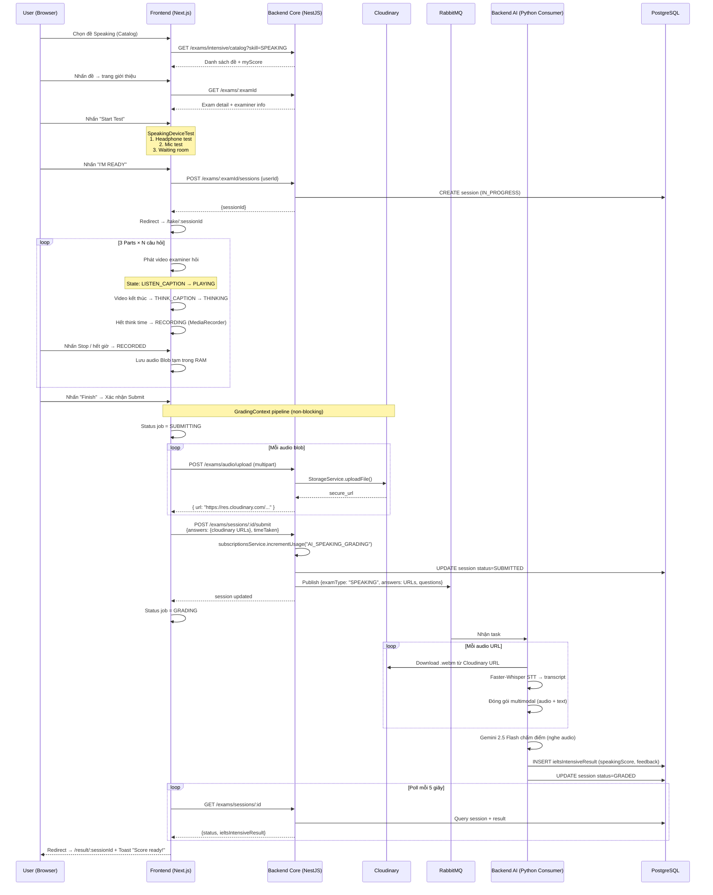

# Luồng hoạt động: Thi thử Speaking — IELTS Intensive (Mock Test)

> Hệ thống: **IELTS Master AI** — thesis-toeic-system
> Tính năng: **Intensive Speaking Mock Test** tại `/ielts/intensive`
> Đây là bài thi toàn phần (Full Test) dựa trên đề Cambridge thực

---

## So sánh nhanh: Intensive vs Advanced Speaking

| Tiêu chí | IELTS Intensive | IELTS Advanced |
|---|---|---|
| Mô hình | Mock Test toàn phần (3 Parts cùng lúc) | Luyện tập từng Part riêng |
| Câu hỏi | Video + Audio (examiner ảo) | Text prompt |
| Upload audio | **Cloudinary** (URL public) | Base64 lưu thẳng DB |
| Polling client | mỗi **5 giây** (GradingContext) | mỗi **3 giây** (useSpeakingSession) |
| Quota control | Có (`AI_SPEAKING_GRADING` per user/tháng) | Không |
| Device Test | **Có** (headphone + mic check trước khi thi) | Không |
| Guard | `JwtAuthGuard` + `ThrottlerGuard` | `JwtAuthGuard` + `SubscriptionGuard` (PREMIUM) |

---

## Kiến trúc tổng quan

```
[Frontend Next.js]
     │  REST + FormData (multipart)
     ▼
[Backend Core — NestJS]  ──RabbitMQ──▶  [Backend AI — FastAPI / GradingConsumer]
     │  PostgreSQL (Prisma)    │               │
     │  Cloudinary SDK         │               │ Faster-Whisper STT
     └─────────────────────────┘               │ Gemini 2.5 Flash
                                               ▼
                                      PostgreSQL (cập nhật kết quả trực tiếp)
```

---

## Luồng chi tiết từng bước

### Bước 1 — Catalog: Chọn đề thi Speaking

**URL:** `/ielts/intensive` → Tab **Speaking**

```
GET /exams/intensive/catalog?skill=SPEAKING
```

Backend `getIntensiveCatalog()`:
- Query `ieltsIntensiveExam` với `type=SPEAKING`, `isPublished=true`
- Filter theo pattern **Cambridge IELTS {N} - Speaking Test {M}**
- Loại bỏ **Cambridge 13** (dành cho Practice riêng)
- Tính `participantsCount`, `completedCount`, `myScore` (điểm cao nhất của user)
- Nhóm theo sách (Cambridge 17, 16, 15…)

---

### Bước 2 — Trang giới thiệu đề (`/ielts/intensive/[examId]`)

```
GET /exams/:examId
```

Trang này **đặc biệt cho Speaking:**
- Hiển thị thẻ **"Your Examiner"** (lấy từ `exam.questions.ieltsIntensiveExaminer`)
- Hiển thị format 3 Parts (Part 1: 4–5 min, Part 2: 3–4 min, Part 3: 4–5 min)
- Nhấn **"Start Test"** → redirect đến:

```
/ielts/intensive/{examId}/start?type=SPEAKING
```

---

### Bước 3 — Device Test (bắt buộc cho Speaking)

**File:** `SpeakingDeviceTest.tsx` — hiển thị trước khi tạo session

Quy trình **3 bước tuần tự:**

```
Step 1: Headphone Check
  → Phát audio test từ Cloudinary CDN
  → Người dùng xác nhận nghe được
  → hasCompletedStep1 = true

Step 2: Microphone Check
  → Ghi âm thử (tối đa 10 giây, tự dừng)
  → Người dùng nghe lại recording
  → hasCompletedStep2 = true

Step 3: Waiting Room
  → Nút "I'M READY" xuất hiện
  → Nhấn → onComplete() → isDeviceTested = true
```

> [!IMPORTANT]
> Nếu `isSpeaking && !isDeviceTested` thì StartPage **không tạo session** — chờ Device Test hoàn thành xong mới proceed.

---

### Bước 4 — Tạo Session (`/ielts/intensive/[examId]/start`)

**File:** `start/page.tsx`

Sau khi Device Test xong, useEffect trigger:

```
POST /exams/:examId/sessions
Body: { userId }
```

Backend `createSession()`:
```typescript
// Tạo session mới, status = IN_PROGRESS
ieltsIntensiveSession.create({
  examId, userId,
  answers: {},
  status: "IN_PROGRESS",
  practicePart: null  // null = full test
})
```

Frontend redirect ngay đến:
```
/ielts/intensive/{examId}/take/{sessionId}
```

---

### Bước 5 — Giao diện thi (`TakeSpeakingBoard` + `SpeakingTaskBoard`)

**File flow:** `take/[sessionId]/page.tsx` → `TakeSpeakingBoard.tsx` → `SpeakingTaskBoard.tsx`

#### State Machine UI (phức tạp hơn Advanced):

```
IDLE
  │ [Play button / Auto-play]
  ▼
LISTEN_CAPTION (2 giây — caption "Listen to the question")
  │
  ▼
PLAYING (video examiner hỏi câu hỏi đang phát)
  │ [video ended]
  ▼
THINK_CAPTION (2 giây — caption "Time to think")
  │
  ▼
THINKING (đếm ngược: 2s Part 1/3 | 60s Part 2)
  │ hết giờ
  ▼
[Nếu có video2] PLAYING_2 (video hỏi thêm/follow-up)
  │ [video2 ended / không có video2]
  ▼
RECORDING (ghi âm, max 60s Part1/3 | 120s Part2)
  │ [Stop / hết giờ]
  ▼
RECORDED → [Next] → câu tiếp / Part tiếp / Submit
```

> [!NOTE]
> **Điểm khác biệt lớn nhất:** IELTS Intensive dùng **video của examiner ảo** (stored trên Cloudinary). Người dùng nghe/xem examiner đặt câu hỏi rồi mới ghi âm trả lời — giống thi thật.

**Ghi âm** vẫn dùng **Web MediaRecorder API** (audio/webm), lưu tạm `{ blob, url }` trong RAM.

**Navigation:**
- `questions[idx]` trong Part 1 và 3 (nhiều câu)
- `cue_card` text + `video` + `video2` trong Part 2
- Phím **Skip** bỏ qua câu hiện tại
- Sau câu cuối cùng → gọi `onSubmit(answers)`

---

### Bước 6 — Submit qua GradingContext (bất đồng bộ)

**File:** `TakeSpeakingBoard.tsx` → `GradingContext.tsx`

```typescript
// TakeSpeakingBoard.handleSubmit():
submitAndTrack({
  sessionId,
  examId,
  examType: "SPEAKING",
  answers: { "0-0": { blob, url }, "0-1": {...}, "1-0": {...} },
  timeTaken: exam.duration * 60 - secondsLeft,
  resultUrl: `/ielts/intensive/${examId}/result/${sessionId}`,
});
```

**GradingContext pipeline** (chạy bất đồng bộ, KHÔNG block UI):

```
Step 1 — SUBMITTING (đăng ký job ngay)
  ↓
  Với mỗi audio blob:
    POST /exams/audio/upload (multipart/form-data)
      → Backend Core: StorageService.uploadFile()
      → Upload lên Cloudinary
      → Trả về { url: "https://res.cloudinary.com/..." }
    Lưu URL thay blob trong finalAnswers["0-0"] = "https://..."
  ↓
Step 2 — Submit answers (URL, không còn blob)
  POST /exams/sessions/:sessionId/submit
  Body: {
    answers: { "0-0": "https://cloudinary.com/...", ... },
    timeTaken: 720
  }
  ↓
Step 3 — GRADING
  startPolling(sessionId) — poll mỗi 5 giây
```

---

### Bước 7 — Backend Core: `submitSession()` cho Speaking

**File:** `exams.service.ts`

```typescript
async submitSession(sessionId, submitDto) {
  // 1. Xác thực session
  const existing = await prisma.ieltsIntensiveSession.findUnique(...)

  // 2. SPEAKING/WRITING → kiểm tra quota trước!
  const allowed = await subscriptionsService.incrementUsage(
    userId, "AI_SPEAKING_GRADING"
  );
  if (!allowed) throw ForbiddenException("QUOTA_EXCEEDED");

  // 3. Update session: status = "SUBMITTED"
  await prisma.ieltsIntensiveSession.update({
    data: { answers, timeTaken, status: "SUBMITTED", submittedAt: new Date() }
  });

  // 4. Không tạo result ngay (chỉ Listening/Reading có result ngay)

  // 5. Publish lên RabbitMQ
  await aiClientService.publishGradingTask({
    sessionId,
    examType: "SPEAKING",
    userId,
    answers: { "0-0": "https://cloudinary...", ... }, // Cloudinary URLs
    questions: exam.questions,  // Toàn bộ JSON câu hỏi
  });
}
```

> [!NOTE]
> **Khác với Advanced Speaking:** ở Intensive, `answers` gửi lên RabbitMQ chứa **Cloudinary URLs** (không phải Base64). Consumer sẽ download audio từ URL đó.

---

### Bước 8 — AI Grading Consumer

**File:** `grading_consumer.py` → `speaking_grader.py` → `transcription_service.py`

Consumer nhận task type `SPEAKING` (không phải `ADVANCED_SPEAKING`):

```python
# grading_consumer._grade_speaking():
feedback = asyncio.run(grade_speaking(
    session_id=session_id,
    exam_questions=questions,   # JSON câu hỏi (parts structure)
    audio_answers=answers       # {"0-0": "https://cloudinary...", ...}
))
```

**`grade_speaking()` — luồng xử lý:**

```
Với mỗi audio (key = "partIdx-questionIdx"):
  1. Nếu URL (http/https): download từ Cloudinary
     → urllib.request.urlopen(url) → bytes
  2. Nếu base64: decode
  3. Ghi temp file .webm
  4. Faster-Whisper: transcribe → text + word timestamps + confidence
  5. Map key "0-1" → tìm questions[0].questions[1].text
     (hoặc cue_card cho Part 2)
  6. Đóng gói multimodal cho Gemini:
     - Part.from_text("[Audio recording for Question 0-1]")
     - Part.from_bytes(audio_bytes, "audio/webm")

Gọi Gemini 2.5 Flash (multimodal):
  - Nghe audio trực tiếp (không chỉ đọc transcript)
  - Chấm 4 tiêu chí IELTS Speaking
  - Trả về JSON overall_band + criteria

Sau grading → _save_result():
  INSERT INTO "results" (speakingScore, feedback) ...
  ON CONFLICT (sessionId) DO UPDATE

→ _update_session_status(session_id, 'GRADED')
  UPDATE "exam_sessions" SET status = 'GRADED'
```

---

### Bước 9 — Polling + Overlay UI

**Trong lúc grading:**

Frontend hiển thị **AI Grading Overlay** toàn màn hình (đen + spinner):

```
"Calculating your score…"
"AI examiner is grading your responses."
[Người dùng có thể rời đi → link "Go back to mock tests"]
[Hoặc ở lại → tự động redirect khi xong]
```

**GradingContext** poll mỗi **5 giây:**

```
GET /exams/sessions/:sessionId
  → kiểm tra session.ieltsIntensiveResult.speakingScore != null
  → hoặc session.status === "GRADED"
  → patchJob(sessionId, { status: "DONE" })
```

Khi `activeJob.status === "DONE"`:
```typescript
router.replace(activeJob.resultUrl);
// → /ielts/intensive/{examId}/result/{sessionId}
```

**Toast notification** (nếu user đã rời trang):
- Toast global bottom-right hiển thị "Your score is ready!"
- Nút "View Results" → navigate đến result page

---

## Sơ đồ tóm tắt toàn bộ luồng



---

## Những điểm quan trọng cần lưu ý

> [!IMPORTANT]
> **Quota control:** Mỗi lần submit Speaking Intensive tiêu thụ `AI_SPEAKING_GRADING` quota của user. Nếu vượt giới hạn tháng → `403 QUOTA_EXCEEDED` + gợi ý nâng cấp subscription.

> [!NOTE]
> **Audio upload tách biệt:** Audio được upload lên Cloudinary **TRƯỚC** khi submit session. Consumer nhận Cloudinary URL và download lại — không gửi file nhị phân qua RabbitMQ.

> [!NOTE]
> **GradingContext là global:** Context này bọc toàn bộ app → user có thể **rời khỏi trang thi** trong lúc AI đang chấm. Khi kết quả xong, toast notification hiện ở góc dưới phải bất kể đang ở trang nào.

> [!WARNING]
> **Không có Resume:** Khác với Advanced, Intensive **không có cơ chế resume** nếu browser bị đóng giữa chừng. Audio Blob chỉ tồn tại trong RAM — mất hết khi reload.

> [!TIP]
> **Key format:** `"partIdx-questionIdx"` (vd: `"0-0"`, `"1-0"`, `"2-1"`) — part 0-indexed, question 0-indexed. Consumer map ngược lại về `exam_questions.parts[partIdx].questions[questionIdx].text` để lấy text câu hỏi khi grading.
